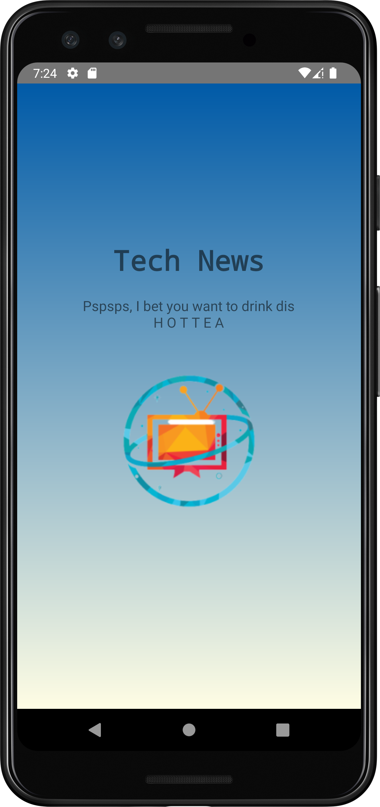

# Tech News

Submission for <strong>"Belajar Membuat Aplikasi Android untuk Pemula"</strong> with Dicoding Academy.

## Submission Checklist

- [x] Display pictures and information in a <strong>List</strong> format with a minimum of 10
  different items
- [x] Direct to <strong>the detail page</strong> when one of the items is clicked
- [x] Show <strong>relevant</strong> pictures and information on the detailed page
- [x] There is <strong>the</strong> about page

# Features and Screenshots

* Splash Screen<br>
  
* Home<br>
  
* News Detail<br>
  
* About<br>
  

## Installation

Download ZIP or clone this repository

```
https://github.com/chaterinamf/Tech-News.git
```

### Author

<strong>[Chaterina Maria Fransisca](https://www.linkedin.com/in/chaterinamf/)</strong>